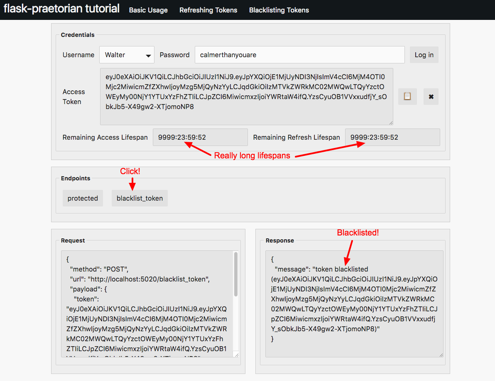
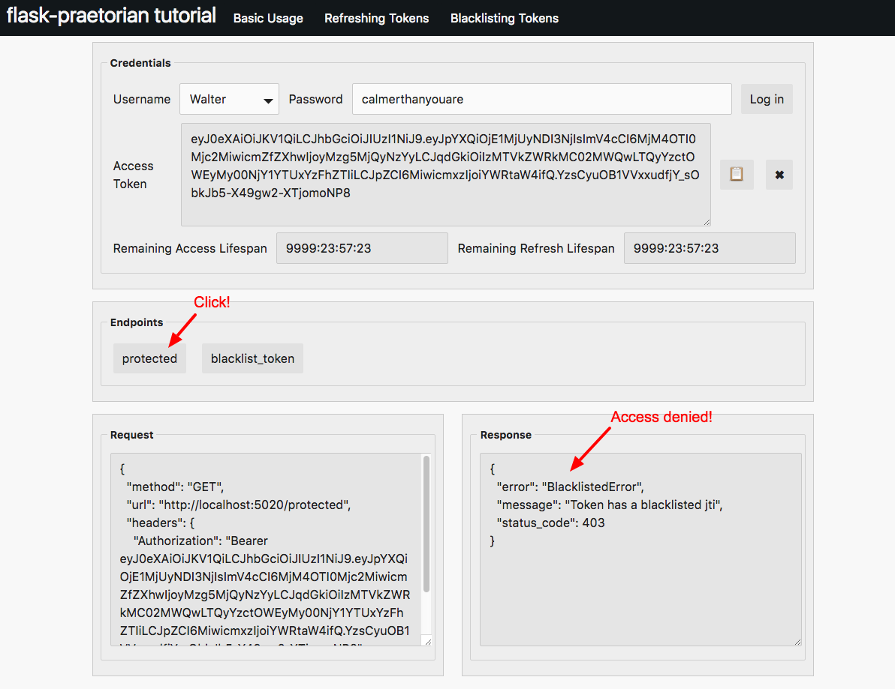

Tutorial (using gui tool)
=========================

This tutorial will use the example code provided in
`example/basic.py
<https://github.com/dusktreader/flask-praetorian/blob/master/example/basic.py>`_.,
`example/refresh.py
<https://github.com/dusktreader/flask-praetorian/blob/master/example/refresh.py>`_.,
and `example/blacklist.py
<https://github.com/dusktreader/flask-praetorian/blob/master/example/blacklist.py>`_.,

Download the entire example directory and save it on your machine where you
will be running through the tutorial.

Requirements
------------

This tutorial requires (outside of the normal python dependencies):

* sqlite
* a web-browser

About the api-tool
------------------

The custom api gui tool is itself a flask-app that uses html and javascript to
render the website. If you are curious about the code feel free to explore, but
don't let the implementation distract you: the author of flask-praetorian is
a back-end dev and javascript is not his strong-suit.

The main thing to focus on as you go through the tutorial is the structure of
the requests and responses. These will be shown by two text boxes at the bottom
of the gui tool.

Starting up the servers
-----------------------

We will need to start up 4 different python/flask applications:

* ``example/basic.py`` is an api that shows basic jwt security concepts
* ``example/refresh.py`` is an api that shows jwt refreshing concepts
* ``example/blacklist.py`` is an api that shows jwt blacklisting concepts
* ``example/api_tool.py`` is the demonstration flask-app that accesses the apis

All four of these should be started. You may kick them off in separate
terminals, or as daemons. It's nice to watch the output from the apps in
terminals, but the api_tool should display all of the request/resonse info that
you need for this tutorial

The flask applications are started easily::

$ python example/basic.py

Each of the api applications runs on a different port to avoid collision. The
api-tool runs on port 5050, and that is where you will access the ui

Accessing the tool
------------------

Once you've started up all four flask apps, you can checkout the gui tool by
navigating to ``http://localhost:5050``

Basic Tutorial
--------------

This section of the tutorial covers concepts demonstrated by ``example/basic``.
These concepts include:

  * Logging in
  * Protected endpoints
  * Role-required endpoints
  * Role-accepted endpoints

Logging in
..........

To access protected endpoints of our example app, we will need to provision a
JWT token from our server for the selected user. This token will be used to
access any proteced endpoints in our app.

In the example source code, you can see where the users are added
(look for 'Add users for the example').

The api-tool pre-populates a drop-down with users (and it will automatically
fill out the passwords too).

Our most basic user is 'TheDude' with the password 'abides'. Let's select this
user in the api-tool:

.. image:: _static/tutorial-basic-1.png

Note that the password can be manually changed. You may find it interesting to
explore the requests/responses that happen by changing the password prior to
log-in or attempting to log in as 'TheStranger'

Next, we'll click the button to log in:

.. image:: _static/tutorial-basic-2.png

Note that when the token is granted, the 'Remaining Acess Lifespan' timer
and the 'Remaining Refresh Lifespan' timers begin counting down. We'll dive
more into the lifespan concepts in the ``Refresh`` section.

In order to provision a jwt token, the POST request does not require any
headers, but it does need to have a payload that includes the username and
password. If you are using flask-praetorian in your app, you should obviously
use https so that your password isn't sent across to the api in the clear.

Finally, the response is a simple json object with one field: ``access_token``.

Accessing a protected endpoint
..............................

Once your user is 'logged in', they can access flask-praetorian protected
endpoints. These endpoints are protected, because they've been decorated with
flask-praetorian's ``@auth_required`` decorator. This means that a request
to these endpoints must carry a valid jwt to gain access.

Let's try to hit the 'protected' endpoint in this tutorial:

.. image:: _static/tutorial-basic-3.png

In this case, the authorization works, and the response carries the JSON
payload returned from the ``example/basic.py`` app's ``protected`` endpoint

Accessing an endpoint with required roles
.........................................

In addition to the ``@auth_required`` decorator, flask-praetorian also provides
decorators that require users to have certain roles to access them.

The ``@roles_required`` decorator keeps users that do not have all of the
required roles from accessing the endpoint. Let's try to hit the
``protected_admin_required`` endpoint with our normal user 'TheDude':

.. image:: _static/tutorial-basic-4.png

So, even though our request has a valid token in the headers, access is not
granted because our user lacks the required role for access.

The flask-praetorian extension registers an error_handler with the flask app
when it is initialized. This error handler automatically converts any
PraetorianError exceptions (or derived exceptions) into a json response that
carries the status code, message, and error type. The status code and error
type can be very useful for applications that need to handle specific error
responses.

Next, let's log in as a user with the admin role and see what happens:

.. image:: _static/tutorial-basic-5.png

This time, our 'admin' user 'Walter' is granted access to the protected
endpoint.

Accessing an endpoint with required roles
.........................................

The last decorator to note is the ``@roles_accepted``. Instead of requiring
all the listed roles, this decorator allows access to users that have any one
of the listed roles.

The ``protected_operator_accepted`` endpoint accepts users that have either
the 'admin' role or the 'operator' role.

Try accessing it with 'TheDude'. You'll see that you are not granted access
because 'TheDude' does not have either the 'admin' or the 'operator' role.

Next, let's try accessing this endpoint with the 'Donnie' user. This user does
not have the 'admin' role, but he does have the 'operator' role:

.. image:: _static/tutorial-basic-6.png

You should try accessing this endpoint with 'Maude' as well. 'Maude' is both an
'admin' and an 'operator'.

In Conclusion
.............

* 'Logging in' entails checking for valid user credentials and granting a jwt
* The flask-praetorian decorators protect endpoints from unauthorized access
* ``@auth_required`` grants access to requests carrying a valid jwt
* ``@roles_required`` grants access to users that have all the listed roles
* ``@roles_accepted`` grants access to users that have one of the listed roles
* PraetorianErrors are automatically handled and packaged as responses

Refresh Tutorial
----------------

This section of the tutorial covers concepts demonstrated by
``example/refresh``. These concepts include:

  * Access and refresh lifespans of the jwt
  * Refreshing a token
  * Disabling users

Lifespans
.........

The JWTs provisioned by flask-praetorian have two distinct lifespans:

The 'access' lifespan is the length of time that a token can access protected
endpoints before it needs to be refreshed.

The 'refresh' lifespan is the length o f teim taht a token can be refreshed
before an entirely new token must be provisioned by 'logging in'.

Both of these lifespans are encoded directly in the JWT. The lifespans that
are provisioned are configured with the ``JWT_ACCESS_LIFESPAN`` and
``JWT_REFRESH_LIESPAN`` configuration settings for the flask app.

To accelerate the demonstration of these lifespans expiring, the ``refresh``
tutorial has much shorter lifespans.  Our demo app includes two countdown
timers to help you see how much lifespan is left for the provisioned JWT:

.. image:: _static/tutorial-refresh-1.png

Refreshing a Token
..................

When a token's access lifespan expires, the token needs to be refreshed. Let's
try logging in as our normal user 'TheDude', waiting for the access lifespan to
expire, and then accessing the 'protected' endpoint:

.. image:: _static/tutorial-refresh-2.png

When we try to access the endpoint, we get a 401 error response that reports
that access has expired.

When this happens, the token should be refreshed:

.. image:: _static/tutorial-refresh-3.png

There are a few things to note here. First, when a token is refreshed, you are
actually given a new token. This new token is a copy of the original token in
that it carries the same 'jti' claim. Also, the refresh lifespan is *not*
renewed in the new token. The 'access' lifespan, however, is renewed.

For subsequent access to protected endpoints, the new 'refreshed' token should
be used.

Once a token's 'refresh' lifespan is expired, that token is worthless. An
entirely new token must be provisioned by 'loggin in'. To demonstrate this,
let's try refreshing a token when the 'refresh' lifespan is expired:

.. image:: _static/tutorial-refresh-4.png

Validating Users
................

One of the performance benefits of using JWTs is that there is no need to
lookup users in the datastore to verify access. Because data queries can be the
slowest part of an application, avoiding this lookup can be a definite
performance gain. Instead of looking the user up, the needed user information
and authorization information is embedded in the JWT and can be very quickly
retrieved.

However, it is imporant to validate users regularly. This is the purpose of
having to refresh tokens. Because the need to 'refresh' tokens is much more
infrequent than simply accessing the endpoints, we can safely add more
expensive operations to the refresh process. Thus, at refresh time, a user is
looked up in the data-store to make sure they still exist and are valid users
(have not been disabled).

To demonstrate this, the api-tool provides a ``disable_user`` endpoint that
can be used to disable the current user in the data-store:

.. image:: _static/tutorial-refresh-5.png

Note that disabling a user does not have any effect until the 'access' lifespan
is expired. So, a disabled user can keep accessing protected endpoints until
access expires. This is why it's important to keep the 'access' lifespan
relatively short; you want disabling a user to have a near-term effect:

.. image:: _static/tutorial-refresh-6.png

So, even though the user was disabled, access is still granted because the
access lifespan hasn't expired.

However, see what happens when we try to refresh a token when the user is
disabled:

.. image:: _static/tutorial-refresh-7.png

Similarly, a user who has been disabled cannot be 'logged in' by the normal
mechanism.

Note that once a user has been disabled, you will need to restart the
``example/refresh.py`` app to re-gain access.

In Conclusion
.............

* JWTs are goverend by their 'access' and 'refresh' lifespans
* A JWT must be refreshed when the 'access' lifespan expires
* A JWT can be refreshed when the 'access' is expired and the 'refresh' is not
* Users are validated at refresh time only

Blacklist Tutorial
------------------

This section of the tutorial covers concepts demonstrated by
``example/blacklist``. These concepts include:

  * Working with long-lived JWT tokens
  * Blacklisting 'jti' claims

Long-lived JWT
..............

Often, RESTful APIs are consumed by other apps. These apps might make thousands
of requests per second and are pre-registered ahead of time as 'trusted' apps.
In these cases, you do not want to have to make the app have to constantly
refresh its token or to 'log in' repeatedly.

So, long-lived JWT are often provisioned for this. The problem is that a long-
lived token might fall into the wrong hands, and your app needs a mechansim to
revoke access from a stolen JWT.

This is what the blacklist is used for

The Blacklist
.............

A JWT token is uniquely identified by its 'jti' claim. For flask-praetorian,
this is provisioned as uuid4. When a token is refreshed, the new token is given
the same 'jti' claim. This serves to identify the two tokens as being really
the same.

A blacklist is a collection of 'jti' claims for tokens that have had access
revoked. The blacklist should be a very performant persistant, container that
minimizes lookup time.

One common pattern is to have a database table that persists the blacklist
data. When an app loads, the blacklist is loaded into some container that lives
in resident memory and has rapid lookup. You can use the 'refreesh' operation
as a mechanism to flush the blacklist back out to the data-store for
persistance so that if your app dies, most of the blacklist is preserved.

For the purposes of our demo, the blacklist is simply a pytyhon ``set`` that is
stored in local memory. To make demonstration of the blacklist more obvious,
the lifespans provisioned for this demo app are obscenely long

Blacklisting a Token
....................

The expample app has an added 'blacklist_token' endpoint that will blacklist
the current token. Let's try blacklisting a token for our admi user, 'Walter':

Now, the token for Walter is blacklisted. No access to any protected endpoint
will be granted because the 'jti' claim from that token will be found in the
blacklist:

In Conclusion
.............

* Apps often get long-lived JWTs
* Access for these long-lived tokens can be controlled with the blacklist
* The blacklist must have very fast lookup
