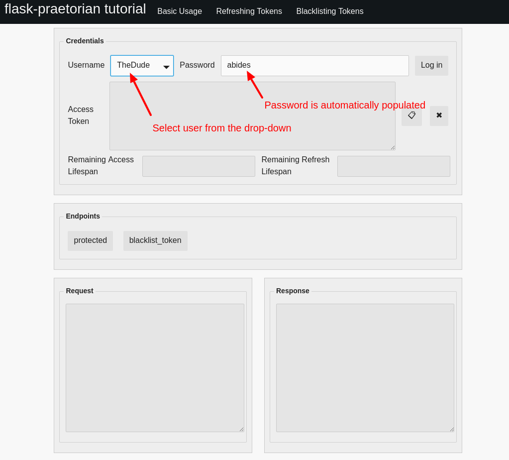
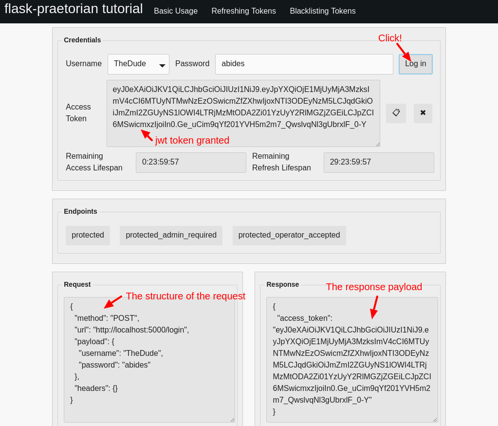
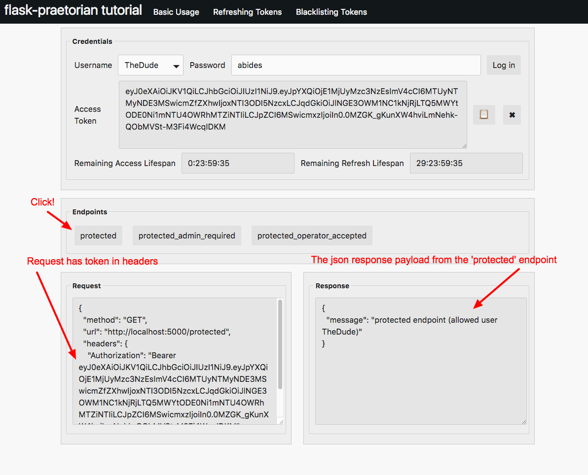
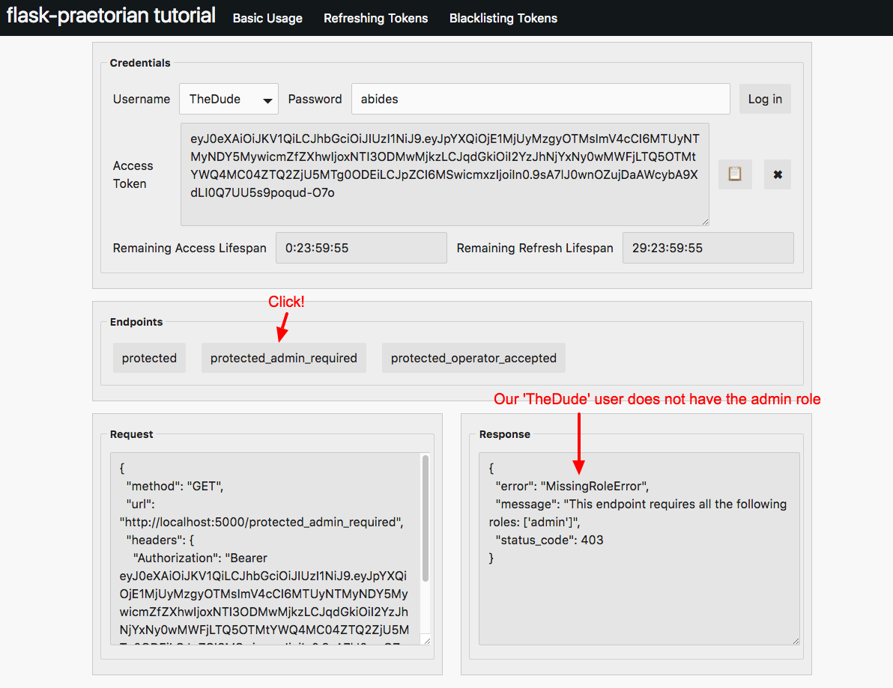
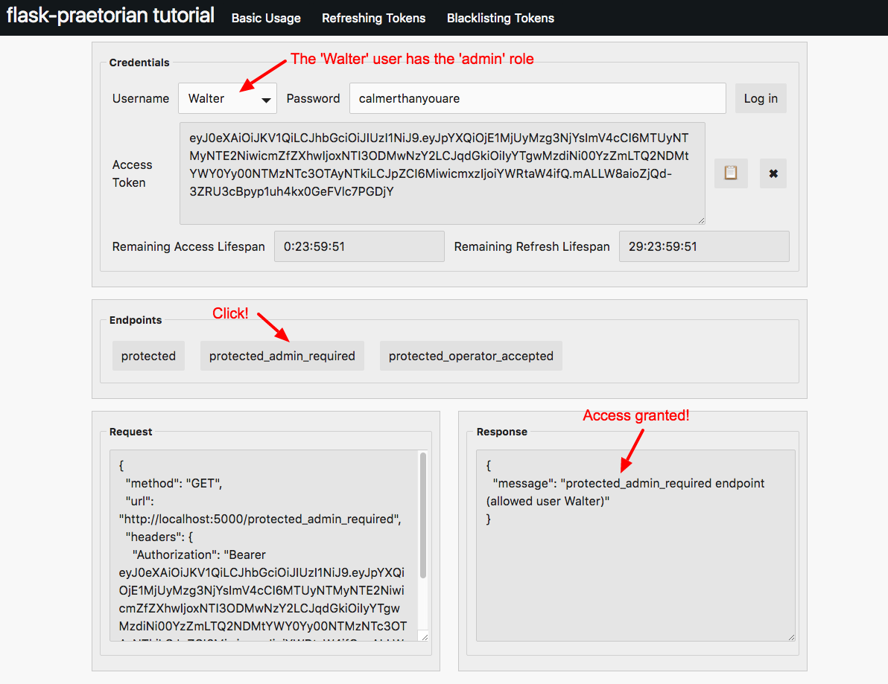
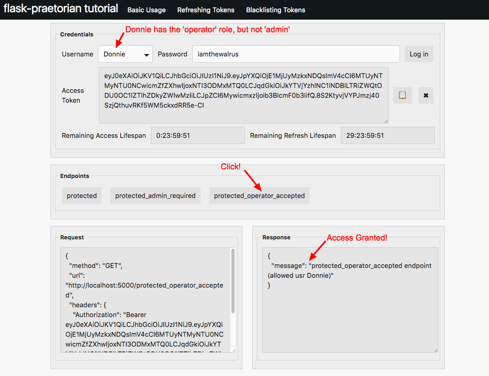

Basic Tutorial
--------------

This section of the tutorial covers concepts demonstrated by
`example/basic.py`_.

These concepts include:

  * Logging in
  * Protected endpoints
  * Role-required endpoints
  * Role-accepted endpoints

Logging in
..........

To access protected endpoints of our example app, we will need to provision a
JWT token from our server for the selected user. This token will be used to
access any protected endpoints in our app.

Usually, you will want to add some endpoint, such as ``login``, to your api.
This endpoint will parse user credentials from a request, authenticate the
user and then encode a JWT for future requests. In our example application,
the ``login`` endpoint looks like this:

.. literalinclude:: ../example/basic.py
   :language: python
   :lines: 88-103
   :caption: from `example/basic.py`_

Of course, to authenticate users, they must be added to whatever data store
that your application uses. Though flask-praetorian does not depend on a
particular data mapper (usually an ORM like SQLAlchemy), it does require that
the user class supplies specific methods and properties.
See :ref:`user-class-requirements`.

The example source code uses SQLAlchemy as the data store, and users are added
as shown:

.. literalinclude:: ../example/basic.py
   :language: python
   :lines: 61-83
   :caption: from `example/basic.py`_

For convenience, the api-tool pre-populates a drop-down with users and
automatically fills in the passwords, too.

Our most basic user is 'TheDude' with the password 'abides'. We'll log in with
this user first

Select 'TheDude' user in the api-tool:

Note that the password can be manually changed. You may find it interesting to
explore the requests/responses that happen by changing the password prior to
log-in or attempting to log in as 'TheStranger'

Next, we'll click the button to log in:

The response is a simple json object with one field: ``access_token``.
This is the token that will be used to access protected endpoints.

Note that when the token is granted, the 'Remaining Access Lifespan' timer
and the 'Remaining Refresh Lifespan' timers begin counting down. We'll dive
more into the lifespan concepts in the ``Refresh`` section.

If you are using flask-praetorian in your app, and create a ``login`` endpoint
that accepts user credentials like this, you should obviously use https so that
your password isn't sent across to the api in the clear.

Accessing a protected endpoint
..............................

Once your user has 'logged in' by securing a JWT, they can access
flask-praetorian protected endpoints by including the token in the request
header. These endpoints are protected, because they've been decorated with
flask-praetorian's ``@auth_required`` decorator. This means that a request
to these endpoints must carry a valid jwt to gain access:

.. literalinclude:: ../example/basic.py
   :language: python
   :lines: 106-119
   :caption: from `example/basic.py`_

Let's try to access the 'protected' endpoint in the example app

Assuming that you still have the token that you acquired by logging in, all you
need to do is click the protected button which sends a request to the protected
endpoint:

In this case, the authorization works, and the response carries the JSON
payload returned from the  app's ``protected`` endpoint.

The flask-praetorian extension by default registers an error_handler with the
flask app when it is initialized. This error handler automatically converts any
PraetorianError exceptions (or derived exceptions) into a json response that
carries the status code, message, and error type. The status code and error
type can be very useful for applications that need to handle specific error
responses.

The available exception types are listed in the `exceptions module
<https://github.com/dusktreader/flask-praetorian/blob/master/flask_praetorian/exceptions.py>`_

Accessing an endpoint with required roles
.........................................

In addition to the ``@auth_required`` decorator, flask-praetorian also provides
decorators that require users to have certain roles to access them.

Each of the additional ``@roles_required`` and ``@roles_accepted`` decorators
do not require the ``@auth_required`` decorator to be explicitly added. They
will implicitly check ``@auth_required`` prior to checking the roles.
However, explicitly adding an ``@auth_required`` decorator as well will not
cause any issues (in fact, this was required in earlier versions).

The ``@roles_required`` decorator keeps users that do not have all of the
required roles from accessing the endpoint:

.. literalinclude:: ../example/basic.py
   :language: python
   :lines: 122-137
   :caption: from `example/basic.py`_

Let's try to access a protected endpoint with required roles.

First, try to access the 'protected_admin_required' endpoint with our basic
user 'TheDude'.

Even though our request has a valid token in the headers, access is not
granted because our user lacks the required role for access.

Next, let's log in as a user with the admin role and see what happens:

This time, our 'admin' user 'Walter' is granted access to the protected
endpoint.

Requests does not have to include any human readable indication of who the user
is.  Instead, everything your app needs to identify the user is embedded in the
JWT token.

It's also worth noting that with the ``@roles_required`` decorator, *each
one of the required roles* must be possessed by the user or access will not be
granted. This means that even if a user has an 'admin' role, they could not
access an endpoint that required 'admin' *and* 'flunky'. They would have to have
a 'flunky' role. There is no concept of role hierarchy in flask-praetorian.

Accessing an endpoint with accepted roles
.........................................

The last decorator to note is the ``@roles_accepted``. Instead of requiring
all the listed roles, this decorator allows access to users that have any one
of the listed roles:

.. literalinclude:: ../example/basic.py
   :language: python
   :lines: 140-156
   :caption: from `example/basic.py`_

The ``protected_operator_accepted`` endpoint accepts users that have either
the 'admin' role or the 'operator' role.

Let's try out the ``protected_operator_accepted`` endpoint

First, try accessing it with 'TheDude'. You'll see that you are not granted
access because 'TheDude' does not have either the 'admin' or the 'operator'
role.

Next, let's try accessing this endpoint with the 'Donnie' user. This user does
not have the 'admin' role, but he does have the 'operator' role:

You should try accessing this endpoint with 'Maude' as well. 'Maude' is both an
'admin' and an 'operator'.

In Conclusion
.............

* 'Logging in' entails checking for valid user credentials and granting a jwt
* The flask-praetorian decorators protect endpoints from unauthorized access
* ``@auth_required`` grants access to requests carrying a valid jwt
* ``@roles_required`` grants access to users that have all the listed roles
* ``@roles_accepted`` grants access to users that have one of the listed roles
* PraetorianErrors are automatically handled and packaged as responses

.. _example/: https://github.com/dusktreader/flask-praetorian/tree/master/example
.. _example/basic.py: https://github.com/dusktreader/flask-praetorian/blob/master/example/basic.py
.. _example/refresh.py: https://github.com/dusktreader/flask-praetorian/blob/master/example/refresh.py
.. _example/blacklist.py: https://github.com/dusktreader/flask-praetorian/blob/master/example/blacklist.py
.. _example/custom_claims.py: https://github.com/dusktreader/flask-praetorian/blob/master/example/custom_claims.py
.. _example/api_tool.py: https://github.com/dusktreader/flask-praetorian/blob/master/example/api_tool.py
