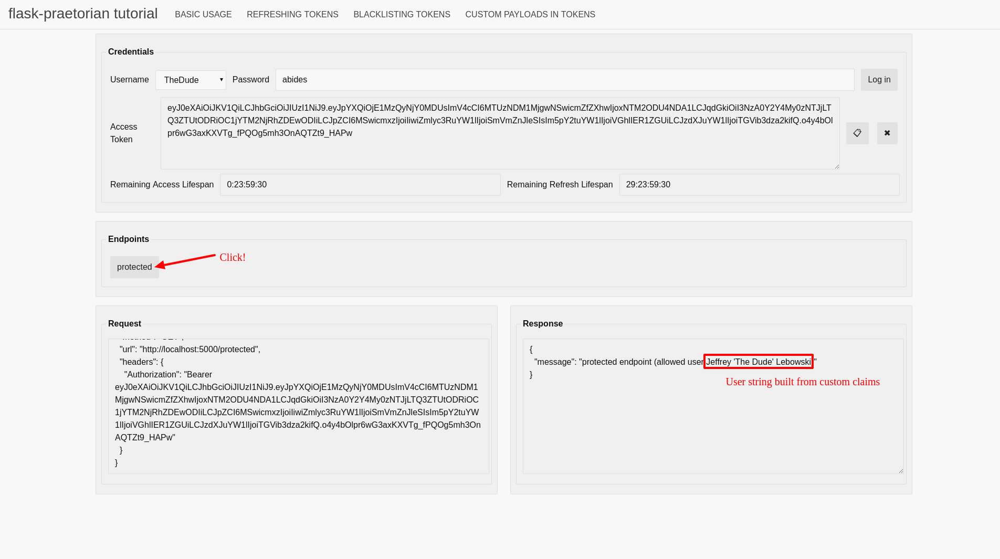

Custom Claims Tutorial
----------------------

This section of the tutorial covers concepts demonstrated by
`example/custom_claims.py`_. These concepts include:

  * Additing addtional custom claims to the jwt

Custom Claims
.............

Your application may need to have additional user data available for endpoints.
Like in the case of authorization, you do not necessarily want to have to
retrieve frequently used user properties from the database. The custom claims
feature of ``flask_praetorian`` allows you to pack addional claims into the
jwt outside of those reserved for the funcitoning of ``flask_praetorian`` and
user authentication and authorization

Reserved Claims
...............

There are a certain set of claims that are reserved by ``flask_praetorian``
that may not be included in the set of custom claims. These are::

  * iat
  * exp
  * rf_exp
  * jti
  * id
  * rls

Outside of these, most keys may be used for additional claims. However,
you should read the
`JWT Web Token Registry <https://www.iana.org/assignments/jwt/jwt.xhtml>`_
to discover if the claim you want to attach already has significance.

Attaching Custom Claims
.......................

Custom claims may be attached by passing additional keyword arguments to
the `encode_jwt_token` method.

The example app adds in additional user fields 'firstname', 'nickname', and
'surname' as custom claims:

.. literalinclude:: ../example/custom_claims.py
   :language: python
   :lines: 117-122
   :caption: from `example/custom_claims.py`_

The claims in this example are encoded into the JWT at login time. You can
see their values being retrieved when you click on the 'protected' endpoint
button and examining the response:

It shoudl be noted that this facility should not be abused. You do not want to
embed a lot of complex data in the JWT. This feature should be used only for
attaching addtional user data that your application needs to function
*quickly*. If performance is not a concern, additional user data should be
retrieved as normal from the database.

In Conclusion
.............

* Addtional data can be attached as custom claims
* Custom claims should not use reserved keys
* Don't abuse the feature

.. _example/: https://github.com/dusktreader/flask-praetorian/tree/master/example
.. _example/basic.py: https://github.com/dusktreader/flask-praetorian/blob/master/example/basic.py
.. _example/refresh.py: https://github.com/dusktreader/flask-praetorian/blob/master/example/refresh.py
.. _example/blacklist.py: https://github.com/dusktreader/flask-praetorian/blob/master/example/blacklist.py
.. _example/custom_claims.py: https://github.com/dusktreader/flask-praetorian/blob/master/example/custom_claims.py
.. _example/api_tool.py: https://github.com/dusktreader/flask-praetorian/blob/master/example/api_tool.py
