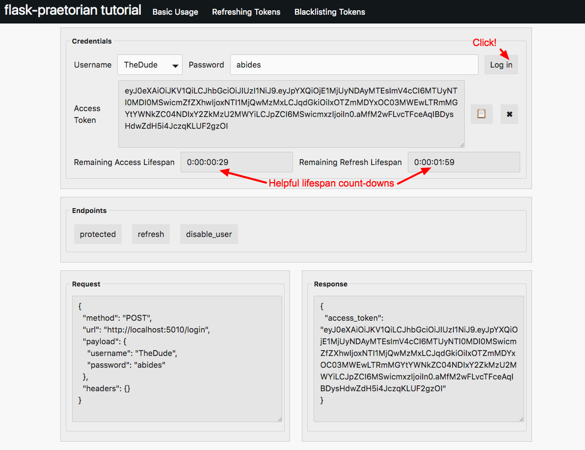
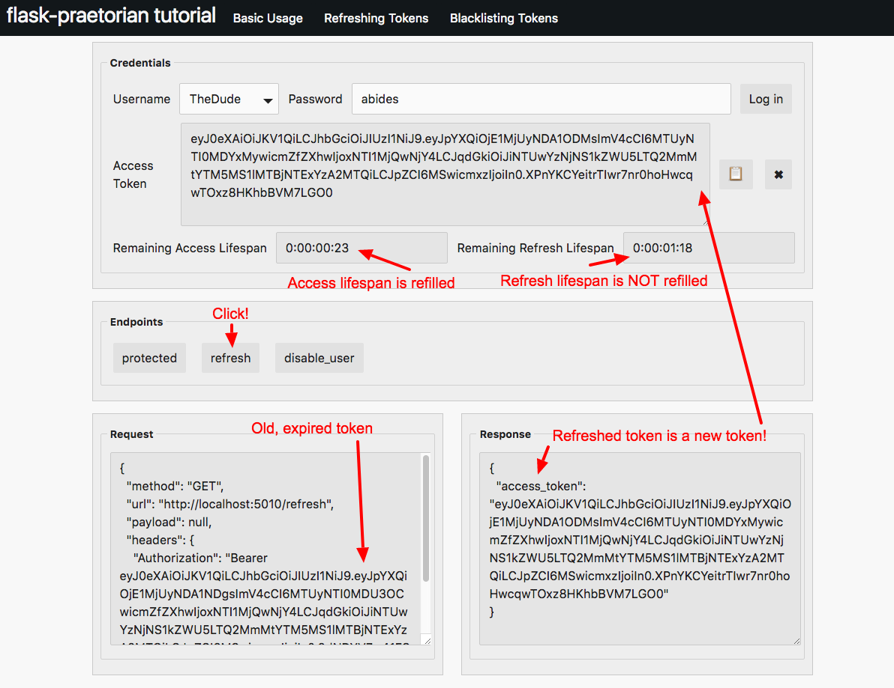
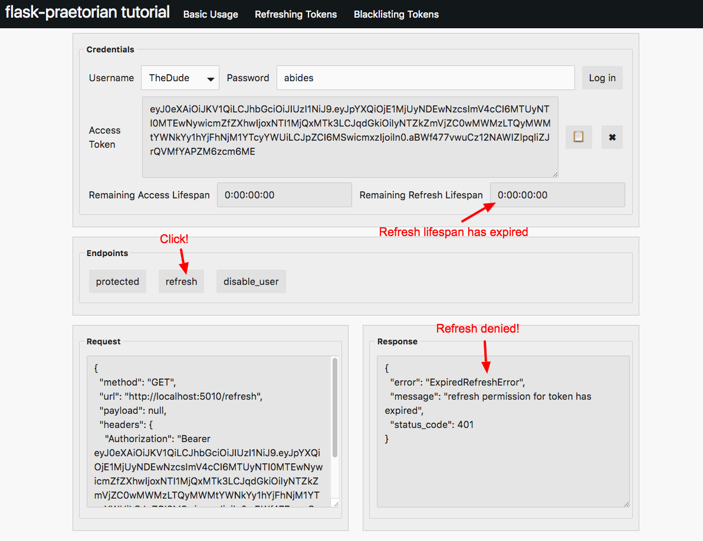
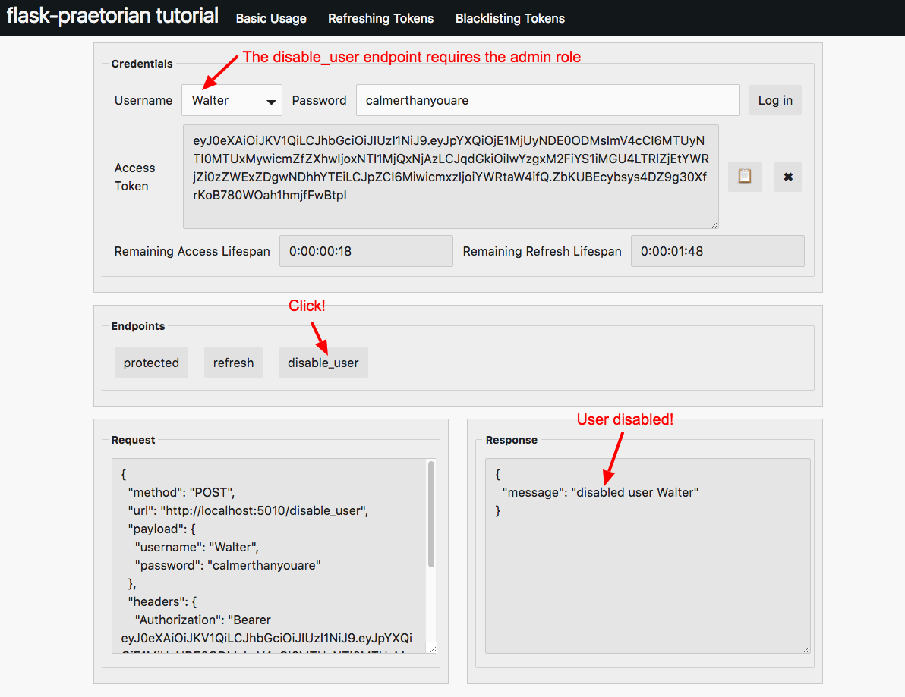
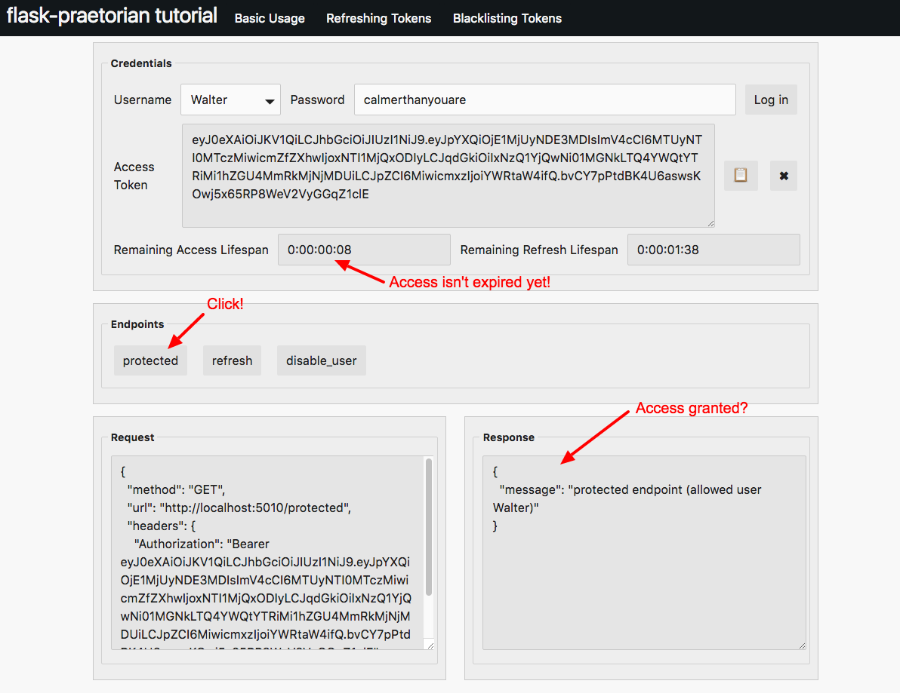
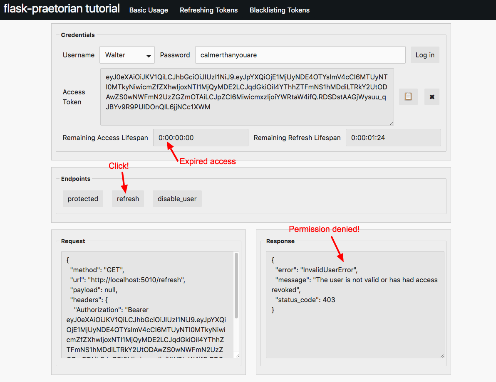

Refresh Tutorial
----------------

This section of the tutorial covers concepts demonstrated by
`example/refresh.py`_.

These concepts include:

  * Access and refresh lifespans of the jwt
  * Refreshing a token
  * Disabling users

Concept
.......

The basic concept of JWT is that essential user information is embedded in the
authorization token that can be very quickly accessed from any route that needs
to be protected. The advantage to this is that the application does not need
to access the data-store at all to check for authorization. In most
applications, accessing the data-store can be one of the most costly
operations. So, JWT offers a nice work around so that routes that do not need
to access the store can do so very quickly and simply.

Because we're using the token alone to authorize a user, and because
the token is issued once with all the information that's needed, logging out
a user is not so straight-forward. Thus, tokens need to have an expiration.

This is where the concept of refreshing a token comes in. We want to make sure
that we check the status of a user regularly (to make sure they haven't been
removed from the system), but we don't want to do this on every api request. We
also don't want to make the user have to regularly enter their credentials to
access the API. Ideally, entering credentials would be an infrequent operation.

So, flask-praetorian adds the ability to refresh a token. The general
guidelines are that a token should need to be refreshed relatively frequently
(the default is 15 minutes) and issuing new tokens should not have to happen
very frequently at all (the default is 30 days).

Lifespans
.........

The JWTs provisioned by flask-praetorian have two distinct lifespans:

The 'access' lifespan is the length of time that a token can access protected
endpoints before it needs to be refreshed.

The 'refresh' lifespan is the length of teim taht a token can be refreshed
before an entirely new token must be provisioned by 'logging in'.

Both of these lifespans are encoded directly in the JWT. The lifespans that
are provisioned are configured with the ``JWT_ACCESS_LIFESPAN`` and
``JWT_REFRESH_LIESPAN`` configuration settings for the flask app. The example
app configures these like so:

.. literalinclude:: ../example/refresh.py
   :language: python
   :lines: 47-48
   :caption: from `example/refresh.py`_

However, in a real app, these are settings that you will probably want added
to the config prior to initializing the app.

To accelerate the demonstration of these lifespans expiring, the ``refresh``
tutorial has much shorter lifespans.  Our demo app includes two countdown
timers to help you see how much lifespan is left for the provisioned JWT:

If you want to use ``curl`` for this section, you will have to have quick
fingers!

Refreshing a Token
..................

When a token's access lifespan expires, the token needs to be refreshed before
protected endpoints can be accessed again.

Let's try logging in as our normal user 'TheDude', waiting for the access
lifespan to expire, and then accessing the 'protected' endpoint:

.. image:: _static/tutorial-refresh-2.png

When we try to access the endpoint, we get a 401 error response that reports
that access has expired.

When this happens, the token should be refreshed. The recommended way to do
this is to have a ``refresh`` endpoint in your app that performs the refresh.
In general, this endpoint doesn't need to do anything but fetch the existing
JWT from the header and return a new one:

.. literalinclude:: ../example/refresh.py
   :language: python
   :lines: 106-119
   :caption: from `example/refresh.py`_

In the api tool, the endpoint is accessed by clicking on the 'refresh' button:

There are a few things to note here. First, when we say a token is refreshed,
we mean that a new token is issued. This new token is a copy of the original
token in that it carries the same 'jti' claim. Also, the refresh lifespan is
*not* renewed in the new token. The 'access' lifespan, however, is renewed.

For subsequent access to protected endpoints, the new 'refreshed' token should
be used.

Once a token's 'refresh' lifespan is expired, that token is worthless. An
entirely new token must be provisioned by 'loggin in'. To demonstrate this,
let's try refreshing a token when the 'refresh' lifespan is expired:

Validating Users
................

One of the performance benefits of using JWTs is that there is no need to
lookup users in the datastore to verify access. Because data queries can be the
slowest part of an application, avoiding this lookup can be a definite
performance gain. Instead of looking the user up, the needed user information
and authorization information is embedded in the JWT and can be very quickly
retrieved.

However, it is imporant to validate users regularly. This is the purpose of
having to refresh tokens. Because the need to 'refresh' tokens is much more
infrequent than simply accessing the endpoints, we can safely add more
expensive operations to the refresh process. Thus, at refresh time, a user is
looked up in the data-store to make sure they still exist and are valid users
(have not been disabled).

To demonstrate this, the example provides a ``disable_user`` endpoint that
can be used to disable the current user in the data-store:

.. literalinclude:: ../example/refresh.py
   :language: python
   :lines: 138-154
   :caption: from `example/refresh.py`_

In the api tool, this is activated by clicking on the 'disable_user' button:

Note that disabling a user does not have any effect until the 'access' lifespan
is expired. So, a disabled user can keep accessing protected endpoints until
access expires. This is why it's important to keep the 'access' lifespan
relatively short; you want disabling a user to have a near-term effect:

So, even though the user was disabled, access is still granted because the
access lifespan hasn't expired.

However, see what happens when we try to refresh a token when the user is
disabled:

Similarly, a user who has been disabled cannot be 'logged in' by the normal
mechanism.

Note that once a user has been disabled in this tutorial, you will need to
restart the ``refresh`` app to re-gain access.

In Conclusion
.............

* JWTs are goverend by their 'access' and 'refresh' lifespans
* A JWT must be refreshed when the 'access' lifespan expires
* A JWT can be refreshed when the 'access' is expired and the 'refresh' is not
* Users are validated at refresh time only

.. _example/: https://github.com/dusktreader/flask-praetorian/tree/master/example
.. _example/basic.py: https://github.com/dusktreader/flask-praetorian/blob/master/example/basic.py
.. _example/refresh.py: https://github.com/dusktreader/flask-praetorian/blob/master/example/refresh.py
.. _example/blacklist.py: https://github.com/dusktreader/flask-praetorian/blob/master/example/blacklist.py
.. _example/api_tool.py: https://github.com/dusktreader/flask-praetorian/blob/master/example/api_tool.py
